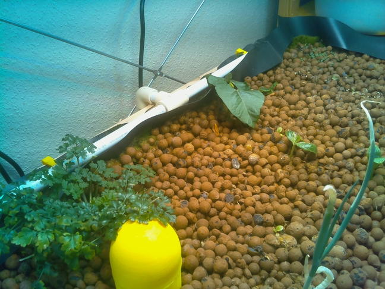

------------------------------------

Title:  Picking up the pace

Author: Mark Moissette

Date:   2016-10-28

------------------------------------


##Picking up the pace


###Overall:

It has been a long long time since I wrote anything regarding progress , which is a shame !
Lots of things have happened, and I am wasting a lot less time, so,  much progress !

####The big crash
* there was a catastrophic 'system failure' this summer: a few days forced absence prevented
  me from feeding the fish, the largest of which died , and cause a nitrate spike that
  I was not able to get under control : despite only feeding the fish every 3 days or so, the
  nitrate levels remained extremely high, all the remaining fish showed sign of nitrate poisoning
  and other illnesses & they sadly died one by one.
* I am still not 100% sure about what happened, & if there was no
* I 'rebooted' the fish part of the system by letting it cycle for a few weeks without fish

####The reboot

On the biological side:
======================
* fishes (6X) were reintroduced
* the lettuce that had gone to seed & other half grown plants were removed
* new seeds were planted, of large plants this time (beans & zuchini), even if they fail , valuable information
can be gained !

On the hardware side:
======================
* sensor node prototypes (still based on ESP8266) have been deployed in & outdoors and running stable for about two weeks
with recordings *every minute* !! Way overkill, but meant only as a test.
* These nodes now communicate via MQTT
* I was quite impressed by the fact that even a sub optimal setup for the outdoor /mini greenhouse node did not cause
the battery of the solar setup to go down *AT ALL* even after multiple consecutive days of overcast weather.

#####Time flies
  Image capture
  =============
  I finally stopped wasting time and got a basic image capture and timelapse going within a few days:

  For capturing the images I originally tried a (very very cheap) webcam together with a [CHIP](https://getchip.com/pages/chip) , using the `fswebcam` command

        ```
        fswebcam --flip v --save /home/$USER/image.jpg -d /dev/video0 -r 800x600
        ```

  Because of the poor image quality and fov, I then switched over to an RPi3 + Rpi cam (v1.3) with a simple [Mosquito](https://mosquitto.org/) mqtt client setup to send send pictures of the indoor setup every 10 minutes

  As for the actual sending of the images, it can be done in a trivial manner :

        ```
        mosquitto_pub -h HOSTIP -t test -f image.jpg
        ```

  The quality and simplicity is great (reduced to 25% for size)! 


  Timelapse
  =========

  * on the host (for now my dev computer), I then used [ImageMagick](http://www.imagemagick.org/script/index.php) to convert
  the individual images into a timelapse, first as animated gif :


  * And then later into a full fledged video

    > -resize 25% reduces the size of the images to 25% (needed given the huge input resolution)
    > - delay 5 sets the delay between frames
    > the rest should be self explanatory

          ```
          convert -resize 25% -delay 5 capture-*.jpg plantlapse.m4v
          ```

    > Note: carefull when trying to create animated images with non padded numbering ! (ie img0, img9 etc instead
    of img000 , img001 etc) you will get messy results

  * The (fascinating) result :

    

####Next steps

Too much to list here, come back in a year !
Jokes aside, there is lots to be done still:
- actually record the values returned by the various sensor nodes
- move all host code to a more permanent host not 100% sure yet if that one will be another Raspberry Pi or something a bit more higher end ...or lower end
- possibly have fun with distributed storage on the cheap : (CHIP + usb thumbdrive ?)
